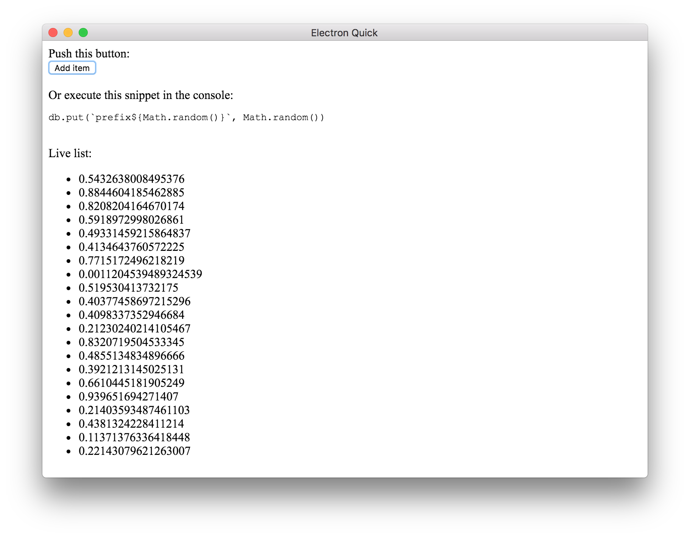

# preact-level-list

Live updating [leveldb](https://leveldb.org) list component for [preact](https://preactjs.com/)!

## Example

```js
import { h, render, Component } from 'preact'
import level from 'level'
import { List } from 'preact-level-list'

const db = level('/tmp/preact-level-list')

class Example extends Component {
  render () {
    return (
      <ul id="example">
        <List
          db={db}
          prefix='prefix'
          renderRow={ ({ value }) => <li>{value}</li> }
        />
      </div>
    )
  }
}
```

Now the `<List />` component will always reflect the values you have stored in your database with `prefix`.

Find a full example in [/example](example):

```bash
$ npm install
$ npm run rebuild
$ npm start
```



## Installation

```bash
$ npm install preact-level-list
```

## API

### `<List db prefix renderRow />`

## License

MIT
